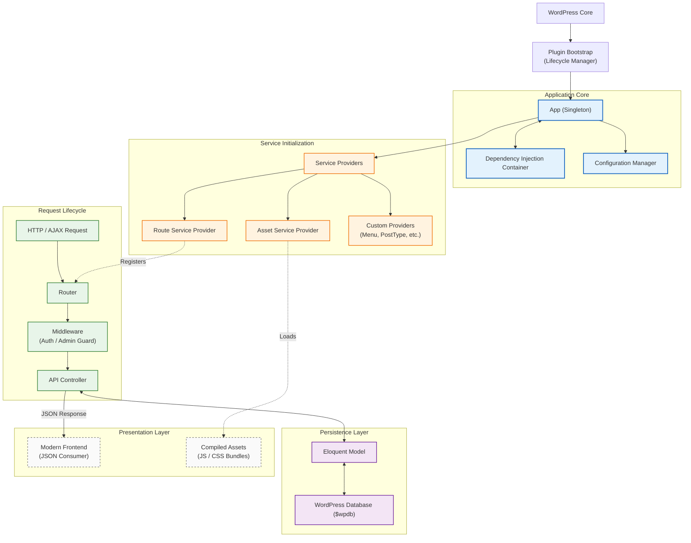

# Request Lifecycle

WpMVC manages the request lifecycle by abstracting WordPress hooks into a structured pipeline. This ensures that every request follows a predictable path, making debugging and extension straightforward.

## Lifecycle Overview

The following diagram illustrates the high-level orchestration of a request lifecycle, from the initial WordPress core hook to the final delivery.

---

## Internal Workflow

1.  **Entry Point**: WordPress loads the plugin, triggering the lifecycle manager.
2.  **App Bootstrapping**: The `App` singleton and `Container` are initialized.
3.  **Provider Registration**: Service Providers are registered and their `boot` methods are executed.
4.  **Routing**: The `Router` matches incoming HTTP/AJAX requests.
5.  **Middleware Pipeline**: The request passes through any assigned middleware for validation or security.
6.  **Controller Execution**: The controller handles business logic and interfaces with models.
7.  **Response Delivery**: The results are returned as a JSON response or rendered view.
